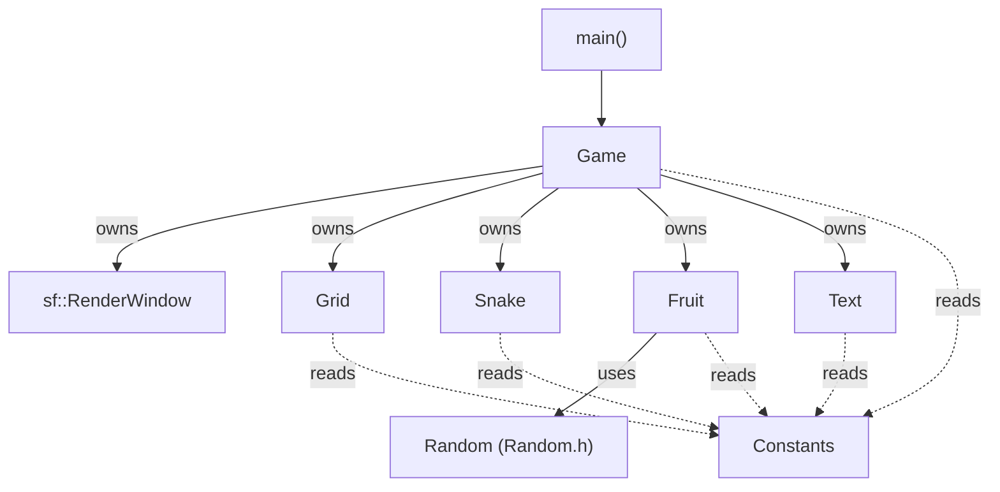

# 1. Overview

[Back to README](README.md) · Purpose: explain what RetroSnake is and how it is organized.

## What it does

RetroSnake is a classic Snake game. The window is a grid of 20×20-pixel cells. The snake starts in the middle, standing still, and moves one cell at a time once you press a direction key. Eating the red fruit adds one segment and one point. Every 20 points raises the level and makes the snake move faster (up to a limit, see [Level and speed](06-examples.md#example-3-level-and-speed-table)).

The game ends when the head leaves the window or touches the snake's own tail. There is no game-over screen, restart, pause, high score, or sound: after a short freeze the window simply closes.

## Controls

| Key | Action |
|---|---|
| `W` or `↑` | Move up |
| `S` or `↓` | Move down |
| `A` or `←` | Move left |
| `D` or `→` | Move right |
| `H` | Show or hide the on-screen text (score, level, FPS) |
| Window close button | Quit |

If you hold two direction keys at once, the first one in this order wins: up, down, left, right.

## Rules and numbers

| Rule | Value | Where it lives |
|---|---|---|
| Window size | 640 × 480 px | `Constants.h` (`wWIDTH`, `wHEIGHT`) |
| Cell size | 20 px | `Constants.h` (`GRID_SIZE`) |
| Grid size | 32 columns × 24 rows = 768 cells | derived |
| Snake start cell | pixel (320, 240), standing still | `Snake::Snake()` |
| Starting delay between steps | 0.15 s | `Game::moveDelay` |
| Points per fruit | 1 | `Game::Render()` |
| Level up | when score ≥ level × 20 | `Game::LevelUp()` |
| Frame rate cap | 60 FPS | `Game::Game()` |
| Delay on game over | 2 seconds, then window closes | `Game::Run()` |

## Dependencies

| Dependency | Needed for |
|---|---|
| C++17 compiler | `inline` variables, `std::optional`, structured use of SFML 3 |
| SFML 3.1 Graphics, Window, System | Window, shapes, text, keyboard, clocks |
| SFML 3.1 Audio, Network | Requested by `CMakeLists.txt` but **not used** by any code |
| `HomeVideo-BLG6G.ttf` | The font for score/level/FPS text |

## Project tree

```
RetroSnake-master/
├── CMakeLists.txt          Build script (finds SFML, builds one executable)
├── .vscode/
│   └── c_cpp_properties.json   Editor IntelliSense settings (MinGW + SFML include paths)
├── assets/
│   └── fonts/
│       ├── HomeVideo-BLG6G.ttf       Font used by the game
│       └── HomeVideoBold-R90Dv.ttf   Bold font, not referenced by any code
├── include/
│   ├── Constants.h         Window and grid size constants
│   ├── Random.h            Random integer helper (header-only, no SFML)
│   ├── Grid.h              Grid class (draws the grid lines)
│   ├── Fruit.h             Fruit class
│   ├── Snake.h             Snake class
│   ├── Text.h              On-screen text (score, level, FPS)
│   └── Game.h              Game class: owns everything, runs the loop
├── src/
│   ├── Main.cpp            Creates a Game and runs it
│   ├── Game.cpp            Game loop, collisions, scoring, leveling
│   ├── Snake.cpp           Input, movement, growth, eating, drawing
│   ├── Fruit.cpp           Random placement and drawing
│   ├── Grid.cpp            Grid line drawing
│   └── Text.cpp            Font loading and text updates
└── build/                  Committed build output (Ninja files, .obj files,
                            RetroSnake.exe, SFML DLLs). Not source code.
```

## How the classes fit together



`Game` is the only class that knows about the others. `Snake`, `Fruit`, `Grid`, and `Text` never talk to each other directly. When the game needs to know "did the snake reach the fruit?", `Game` asks the snake for its position, asks the fruit for its position, and compares them. Each class has its own `Draw(window)` that `Game` calls.

## Glossary

| Term | Meaning here |
|---|---|
| Cell | One 20×20-pixel square of the grid |
| Head | The snake's front square; its position is `Snake::snake` |
| Tail | The list of body squares behind the head (`Snake::tail`), newest first |
| Step | One move of the snake by one cell |
| `moveDelay` | Seconds the snake waits between steps; smaller means faster |
| HUD | The score / level / FPS text on screen |
