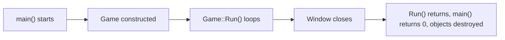
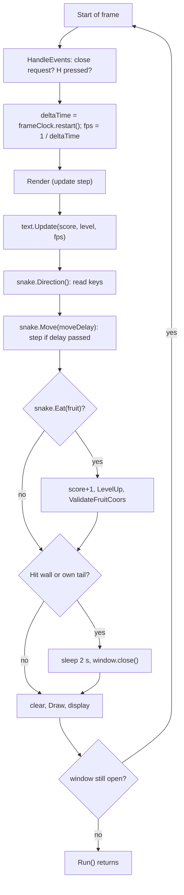
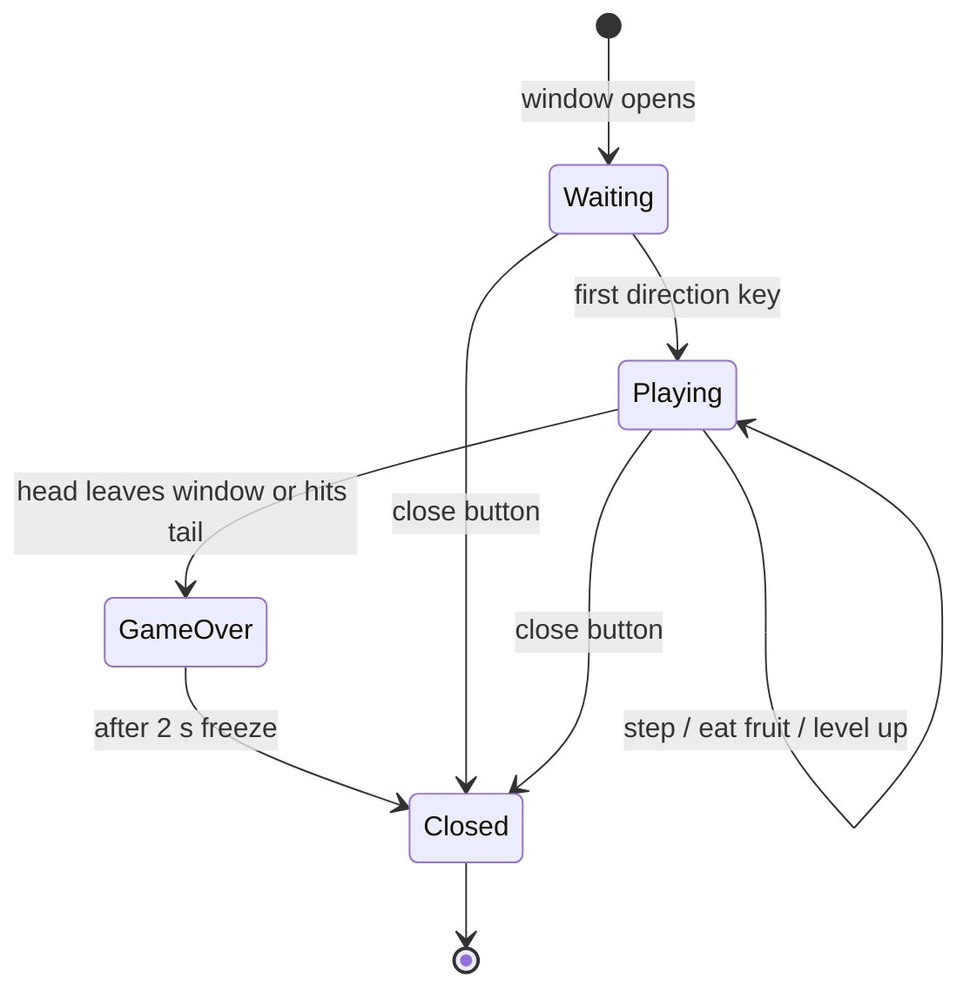

# 4. Lifecycle and States

[Back to README](README.md) · Purpose: explain what happens, in what order, from launch to exit.

## Program lifecycle



There is no manual memory management anywhere: every object is a stack object or a member, and SFML and the standard containers clean up in their destructors.

### Construction order

`Game` members are built in the order they are declared in `Game.h`:

1. `window`: the 640×480 window opens (initializer list in `Game()`), then the constructor body sets the 60 FPS cap
2. `grid`
3. `snake`: head at (320, 240), tail empty, not moving
4. `fruit`: random position, **not checked** against the snake
5. `text`: loads the font, so a missing font fails *here*, after the window already exists
6. private members: `frameClock` starts, `moveDelay = 0.15`, `score = 0`, `level = 1`, `showText = true`

## The frame loop

Every pass of `Game::Run()` does the following, at most 60 times per second:



Two things to notice:

- The snake only steps when `moveClock` has passed `moveDelay` (0.15 s at the start), so the **snake speed is independent of frame rate**. Steps happen on whichever frame comes first after the delay, so real timing is rounded to frame length (about 16.7 ms at 60 FPS).
- Collision is checked **after** the snake has moved but **before** the frame is drawn. See [what the player sees at game over](#game-over-what-actually-happens).

## Game states

The code has no explicit state variable; the states below are implied by the values of the snake's speeds and the window.



| State | How to recognize it in code | What happens |
|---|---|---|
| Waiting | `snakeXSpeed == 0 && snakeYSpeed == 0` | Snake does not move; `Move` only restarts its clock. HUD and fruit are drawn |
| Playing | speeds not both `0` | Snake steps every `moveDelay` seconds. There is no way to stop or pause once moving |
| GameOver | `CheckBorderBounds() \|\| CheckHitSnakeBody(head)` is true | `sf::sleep` for 2 s, then `window.close()` |
| Closed | `window.isOpen() == false` | `Run()` returns |

### Game over: what actually happens

In the frame where the fatal step happens, the order is: update (the snake moves into the wall or tail) → collision detected → **2-second sleep** → `window.close()` → then `clear`, `Draw`, and `display` still run once on the now-closed window.

Consequences:

- During the 2-second freeze the screen shows the **previous** frame (the snake's position before the fatal step), not the crash itself.
- The window does not respond to events during the sleep.
- The last `Draw` and `display` calls happen on a closed window. SFML tolerates this in practice, but the output is never seen.

## How the snake moves and grows

The head moves by one cell per step. The tail is a list of old head positions.

On every step (when the snake has a direction):

1. `oldHeadPos = head position`
2. Move the head one cell
3. Push `oldHeadPos` to the **front** of `tail`
4. If `grow` is false, remove the **last** element of `tail`; otherwise clear `grow` and keep it

The tail starts empty. At the first step it gets one element and immediately loses it (step 4), so it stays empty. That is safe because the push happens before the pop. Eating a fruit sets `grow`, so the next step skips the removal and the tail is one element longer.

**Verified here** (same push/pop logic compiled and run): with 0 fruits eaten the tail stays at 0 elements after 3 steps; after 1 fruit it has 1 element. In short, **tail length = fruits eaten = score**.

```
Moving right, grow=false, tail length 2.   H = head, o = tail

before:   o o H .
step:     . o o H      (new head cell added, last tail cell dropped)
```

## Fruit lifecycle

1. **Born** in `Fruit()` at a random cell (unchecked).
2. **Eaten** when `snake.Eat(...)` finds the head exactly on it (float equality; positions are multiples of 20, so this is exact).
3. **Reborn** immediately: `ValidateFruitCoors()` calls `GenerateCoors()` repeatedly until the position is not the head and not any tail cell.

If the snake ever fills all 768 cells, step 3 can never succeed and the game freezes in an infinite loop (see [known issues](05-usage-guidelines.md#known-behaviors-and-issues)).

## Build variants and platform differences

There is no conditional compilation in the project (`#if`, `#ifdef`, `assert`, `NDEBUG` are all absent), so Debug and Release behave identically. The code is portable C++ and SFML, apart from the Windows paths in `CMakeLists.txt`.
